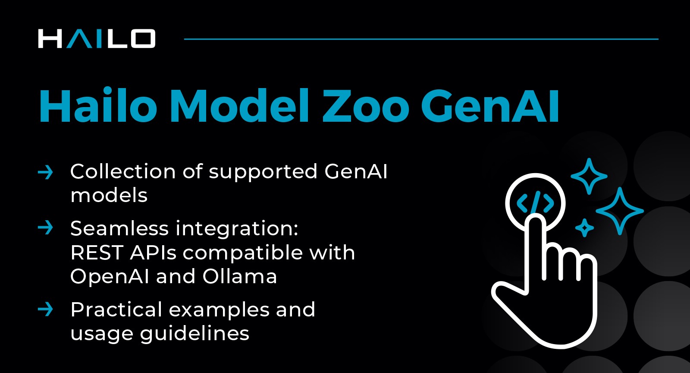

Hailo Model Zoo GenAI
=====================

.. |ollama| image:: https://img.shields.io/badge/Ollama-0.6.0-blue.svg
   :target: https://github.com/ollama/ollama/releases
   :alt: Ollama
   :width: 80
   :height: 20

.. |runtime| image:: https://img.shields.io/badge/HailoRT-5.1.0-brightgreen.svg
   :target: https://hailo.ai/company-overview/contact-us/
   :alt: HailoRT
   :width: 80
   :height: 20

.. |license| image:: https://img.shields.io/badge/License-MIT-yellow.svg
   :target: https://github.com/hailo-ai/hailo_model_zoo_genai/blob/master/LICENSE
   :alt: License: MIT
   :width: 80
   :height: 20

|runtime| |ollama| |license|

The Hailo Model Zoo GenAI is a curated collection of pre-trained models and example applications optimized for Hailo's AI processors, designed to accelerate GenAI application development.
It includes Hailo-Ollama, an `Ollama <https://github.com/ollama/ollama>`_-compatible API written in C++ on top of HailoRT, enabling seamless integration with various external tools and frameworks.

Ollama simplifies running large language models locally by managing model downloads, deployments, and interactions through a convenient REST API.

Models are specifically optimized for Hailo hardware, providing efficient, high-performance inference tailored for GenAI tasks.

Models
------
For a detailed list of supported models, including download links and relevant information, visit the `models <docs/MODELS.rst>`__ page.

Installation
------------

Prerequisites
~~~~~~~~~~~~~

* Hailo-10H module.
* Ensure  `HailoRT <https://github.com/hailo-ai/hailort>`__ is installed.

Two installation methods are available
~~~~~~~~~~~~~~~~~~~~~~~~~~~~~~~~~~~~~~

1. **Pre-built Debian package** (*Recommended*):

  * Download the latest Debian package from the `Developer Zone <https://hailo.ai/developer-zone/>`__.

  * Install it:

    .. code-block::

      sudo dpkg -i hailo_gen_ai_model_zoo_<ver>_<arch>.deb

2. **Build from source** (*Alternative*):

  * Clone the repository and build the Hailo-Ollama server:

    .. code-block::

      git clone https://github.com/hailo-ai/hailo_model_zoo_genai.git
      cd hailo-model-zoo-genai/
      mkdir build && cd build
      cmake -DCMAKE_BUILD_TYPE=Release ..
      cmake --build .

  * Install to **user home** (still in the ``build`` dir):

    .. code-block::

      cp ./src/apps/server/hailo-ollama ~/.local/bin/
      mkdir -p ~/.config/hailo-ollama/
      cp ../config/hailo-ollama.json ~/.config/hailo-ollama/
      mkdir -p ~/.local/share/hailo-ollama
      cp -r ../models/ ~/.local/share/hailo-ollama

Basic Usage
-----------

* Start the Hailo-Ollama server:

  .. code-block::

    hailo-ollama

* List available models:

  .. code-block::

    curl --silent http://localhost:8000/hailo/v1/list

* Pull a specific model. For example:

  .. code-block::

    curl --silent http://localhost:8000/api/pull \
         -H 'Content-Type: application/json' \
         -d '{ "model": "qwen2:1.5b", "stream" : true }'

* Chat with the model:

  .. code-block::

    curl --silent http://localhost:8000/api/chat \
         -H 'Content-Type: application/json' \
         -d '{"model": "qwen2:1.5b", "messages": [{"role": "user", "content": "Translate to French: The cat is on the table."}]}'

Optional Open WebUI
~~~~~~~~~~~~~~~~~~~

Example for running the Hailo-Ollama server with WebUI:

* Install `WebUI <https://docs.openwebui.com/>`__ Ollama client.

* Start the Hailo-Ollama server:

  .. code-block::

    hailo-ollama

* Run WebUI Ollama client:

  .. code-block::

    OLLAMA_BASE_URL=http://127.0.0.1:8000 DATA_DIR=~/.open-webui uvx --python 3.10 open-webui@latest serve

* Access the WebUI at `http://localhost:8080 <http://localhost:8080>`__

For detailed usage instructions and advanced examples, see the `USAGE <docs/USAGE.rst>`__ page.

Changelog
---------

See the `CHANGELOG <docs/CHANGELOG.rst>`__ page for detailed release notes.

License
-------

The Hailo Model Zoo GenAI is distributed under the MIT license. Refer to the `LICENSE <https://github.com/hailo-ai/hailo_model_zoo_genai/blob/master/LICENSE>`__ file for details.

Support
-------

For support, please post your question on the `Hailo community Forum <https://community.hailo.ai/>`__ or contact us directly via `hailo.ai <https://hailo.ai/contact-us/>`__.

About Hailo
-----------
Hailo provides innovative AI Inference Accelerators and AI Vision Processors specifically engineered for efficient, high-performance embedded deep learning applications on edge devices.

Hailo's AI Inference Accelerators enable edge devices to execute deep learning applications at full scale, leveraging architectures optimized for neural network operations. The Hailo AI Vision Processors (SoC) integrate powerful AI inferencing with advanced computer vision, delivering superior image quality and sophisticated video analytics.

For more information, visit `hailo.ai <https://hailo.ai/>`__.